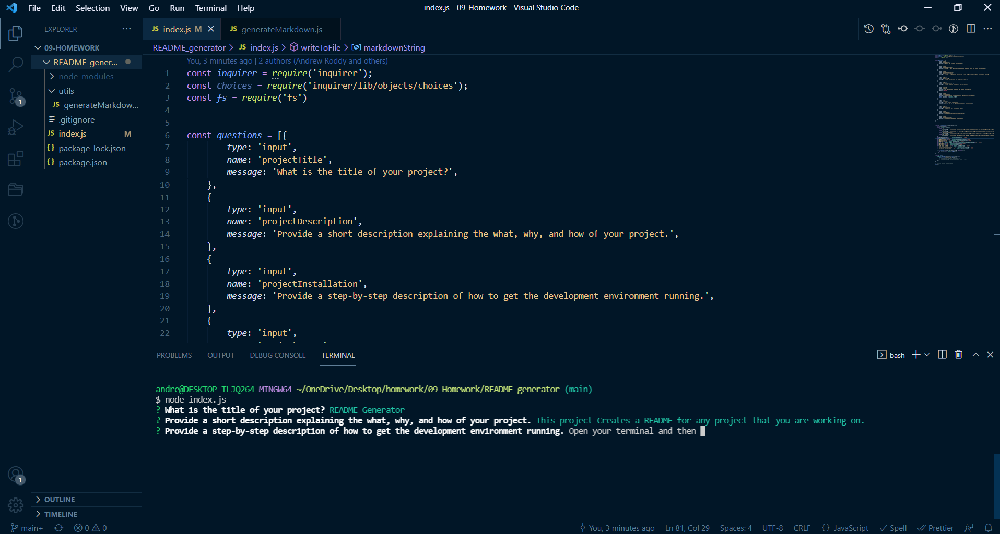

# ReadMe Generator

## Description
This project quickly generates high quality readme files for any project currently being worked on.

## Instillation
Open the directory containing the readme generator and run dnode index.js. Answer the questions that are presented. When completed the answer will be used to create and fill in a README file.

## Usage
Useful for any and all projects or applications that require a README file.

## License
GNU LV3

## Find me on Github
https://github.com/andrewroddy92

## Contribution Guidelines
If you wish to contribute to this project please contact me by email at andrewroddy92@yahoo.com

## Testing Instructions
Look out for any errors that the markdown might have when the README is generated, and run through on different terminals other than bash.

https://drive.google.com/file/d/1JK0856F1I2iJ-sK6qBw5shaRRdVa_wHd/view